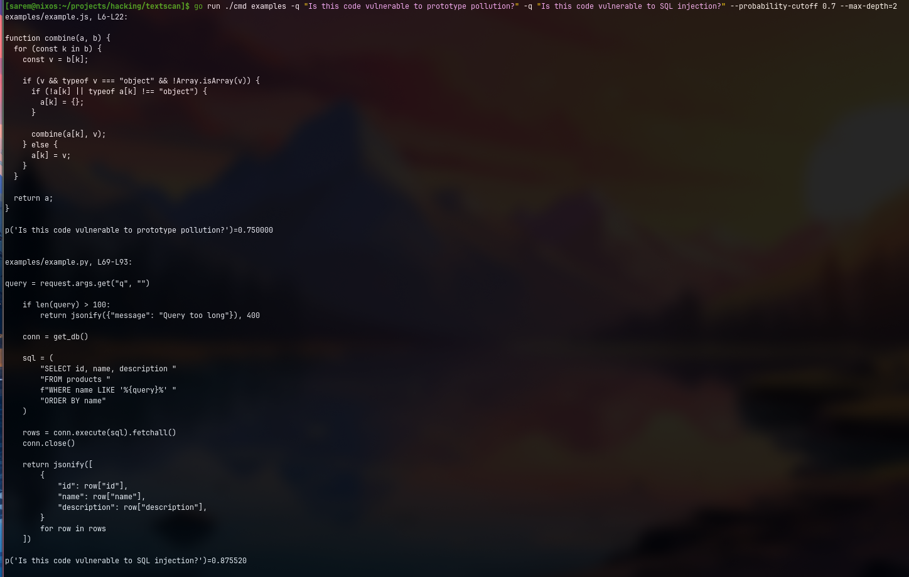

# textscan



`textscan` scans text and source files with JEV and returns matching snippets with per-question probabilities.

## Requirements

- Go 1.26+
- A JEV API key (`JEV_API_KEY`) or `--api-key`

## Quick start

```bash
export JEV_API_KEY="<your-key>"
go run ./cmd examples \
  -q "Is this code vulnerable to prototype pollution?" \
  -q "Is this code vulnerable to SQL injection?" \
  -q "Is this related to Germany?" \
  --probability-cutoff 0.7 \
  --max-depth=3
```

You should see output like matching file/line ranges plus probabilities, for example:

```text
examples/example.js, L6-L22:
...
p('Is this code vulnerable to prototype pollution?')=0.760000
```

For a fuller real output sample and more usage details, see [`example-prompt.txt`](./example-prompt.txt).

## CLI usage

```text
textscan <file-or-directory|-> [flags]

Flags:
  --provider string            Backend provider: vercel or typesafe (default "vercel")
  --api-key string             API key (defaults to JEV_API_KEY)
  --max-depth uint8            Maximum scan depth (default 3)
  --probability-cutoff float   Risk cutoff value between 0 and 1 (default 0.75)
  -q, --question strings       Search question for JEV Noul type
  --filetype string            Required stdin file type: go, js, py, or txt
```
