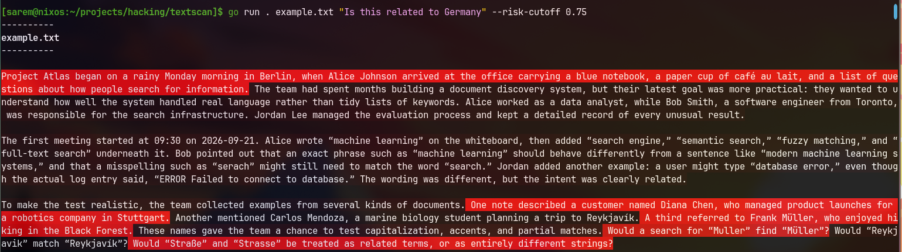

# textscan

`textscan` uses JEV noul queries to highlight English-prose sentences in a
`.txt` file that match a topic.

```sh
JEV_API_KEY=... go run . notes.txt "Does this discuss credential theft?"
```

(or compile it to a binary)

The tool queries every blank-line-delimited paragraph first. A paragraph whose
probability is at least `--risk-cutoff` (default `0.95`) is then split into
English sentences and queried again. Each sentence is printed with ANSI red
background intensity equal to the product of its paragraph and sentence
probabilities.

Options:

- `--provider vercel|typesafe` selects the JEV provider.
- `--api-key KEY` overrides `JEV_API_KEY`.
- `--risk-cutoff FLOAT` controls whether a paragraph is scanned sentence by
  sentence.
